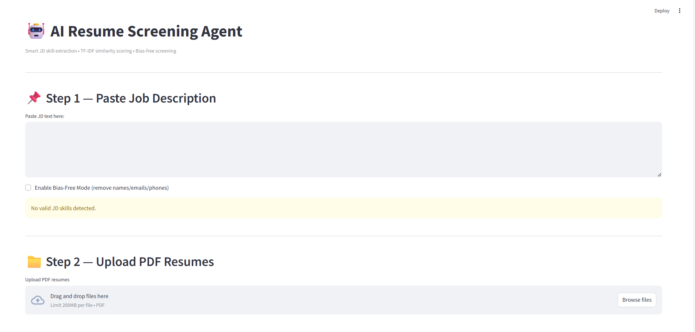
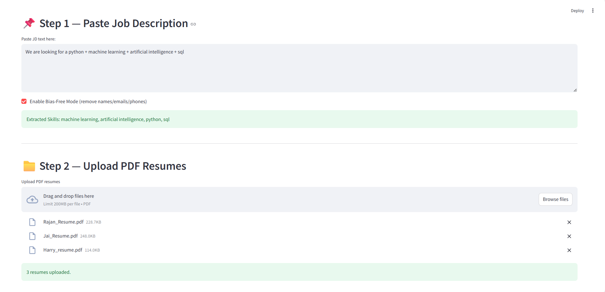
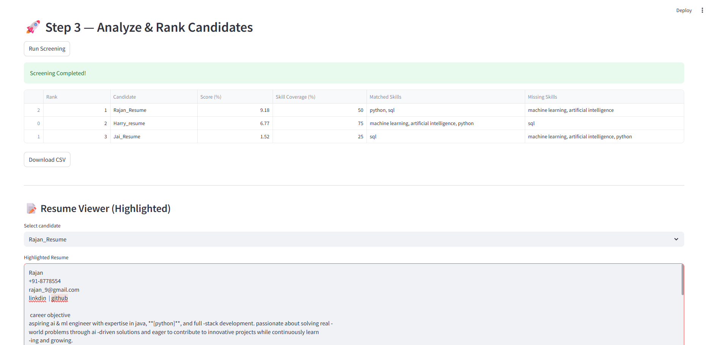
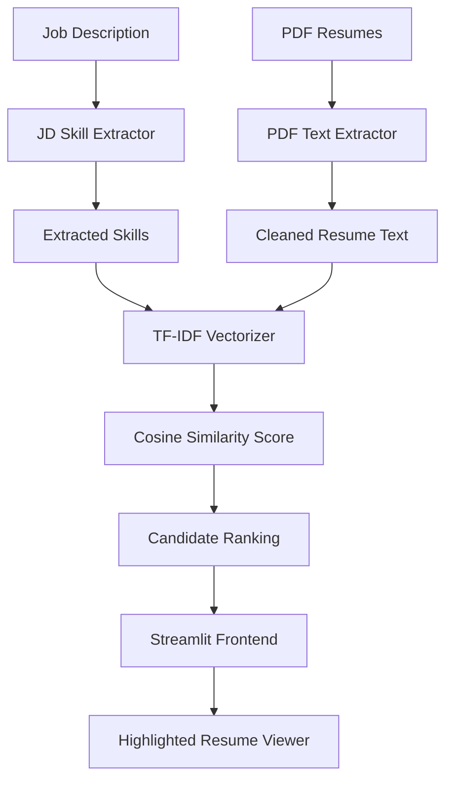

# 🤖 AI Resume Screening Agent

### Paste JD → Upload PDF Resumes → Rank Candidates (TF-IDF Based, 100% Local, No OpenAI)

<p align="left">
  
  
  
  
  
</p>

---

## 🚀 What is AI Resume Screening Agent?

**AI Resume Screening Agent** is an offline ATS-style application that:

- Extracts key technical skills from a Job Description (JD)  
- Parses & analyzes multiple PDF resumes  
- Computes TF-IDF similarity between JD and each resume  
- Detects matched & missing skills  
- Ranks candidates automatically  
- Highlights skills inside the resume viewer  
- Supports Bias-Free Mode (removes name/email/phone)

No OpenAI key.  
No API usage.  
Fully local and deployable on Streamlit Cloud.

---

## ✨ Key Features

- 📌 **JD Skill Extraction (multi-word + single-word)**  
- 📄 **PDF Resume Upload & Processing**  
- 🧠 **TF-IDF Similarity Scoring**  
- 🎯 **Skill Coverage % + Candidate Ranking**  
- 🔍 **Matched / Missing Skill Detection**  
- 📝 **Highlighted Resume Viewer**  
- 🔐 **Bias-Free Mode**  
- ⚡ **100% Offline**  

---

## 📸 Screenshots  
(Add your screenshots inside `/screenshots` folder)

| Home | Upload | Results |
|------|--------|---------|
|  |  |  |


---

## 🧠 Architecture Diagram



---

## 📦 Installation Guide

### 1️⃣ Clone the repository
```bash
git clone https://github.com/yourusername/AI-Resume-Screening-Agent.git
cd AI-Resume-Screening-Agent
```

### 2️⃣ Install dependencies
```bash
pip install -r requirements.txt
```

### 3️⃣ Run the application
```bash
streamlit run app.py
```

---

## 📁 Project Structure

```
AI-Resume-Screening-Agent/
│── app.py
│── README.md
│── requirements.txt
│── Screenshots/                   
│   ├── home.png
│   ├── upload.png
│   ├── results.png
│── sample_resumes/            # Optional sample PDFs
```

---

## 🧩 How It Works

### 1️⃣ Paste Job Description  
→ Extracts real technical skills (python, machine learning, data science, sql, etc.)

### 2️⃣ Upload PDF Resumes  
→ Extracts & cleans text from each resume

### 3️⃣ Run Screening  
→ Computes TF-IDF similarity  
→ Calculates Match Score (%)  
→ Determines Skill Coverage (%)  
→ Identifies matched & missing skills  
→ Ranks all candidates  
→ Provides CSV export  
→ Displays highlighted resume view  

---

## 🔮 Future Improvements

- Experience-based scoring  
- Better multi-word skill detection  
- Resume summarization  
- Multi-JD comparison dashboard  

---

## 📝 License  
MIT License  
© Preetham N

---

## ⭐ Support  
If you like this project, please ⭐ star the repo!
