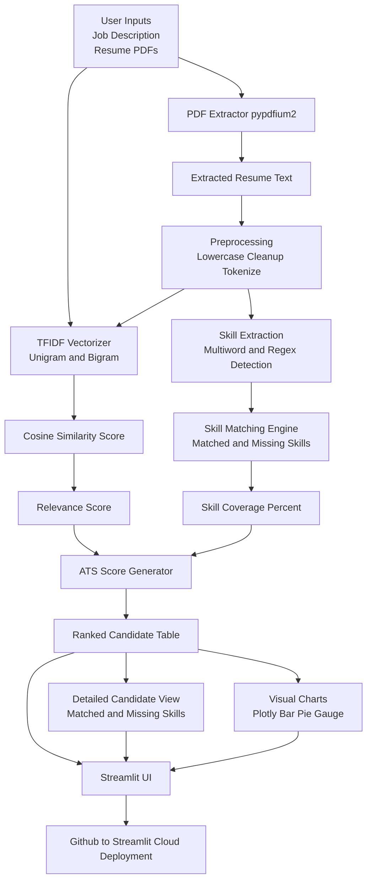
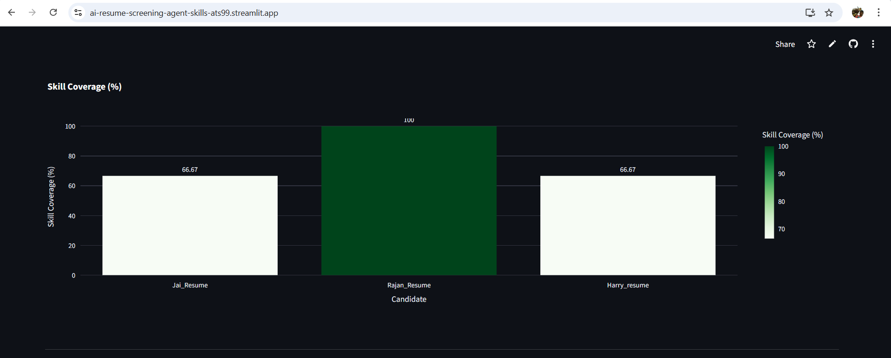
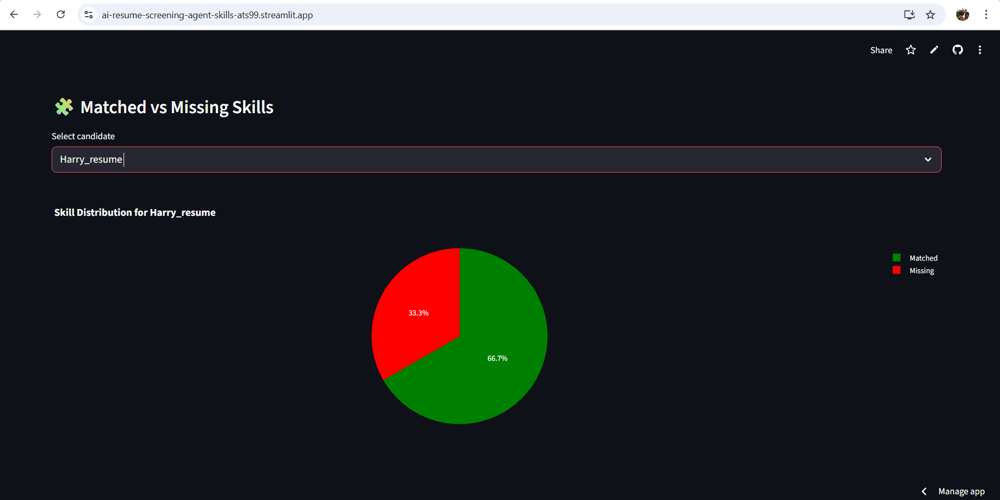
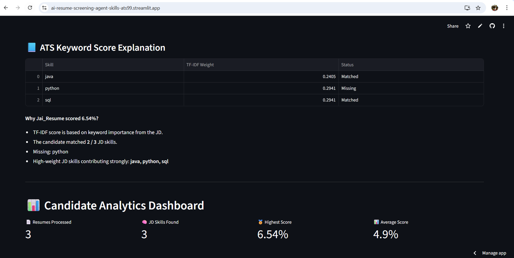

# 🤖 AI Resume Screening Agent

<p align="left">
  
  
  
  
  
</p>

---

## 🚀 What is AI Resume Screening Agent?

# AI Resume Screening Agent (ATS + Skill Matcher + Ranking System)

An AI-powered Resume Screening System that extracts resume text (PDF), analyzes job descriptions, computes similarity using TF-IDF, performs skill extraction, and ranks candidates with ATS-style scoring.  
Built using Python, Streamlit, Scikit-learn, TF-IDF, and pypdfium2.

---

## 🚀 Live Demo
https://ai-resume-screening-agent-skills-ats99.streamlit.app/

---

## ⭐ Features
- Upload multiple resumes (PDF)
- Input Job Description (JD)
- AI-powered text extraction using pypdfium2
- NLP preprocessing & cleaning
- TF-IDF vectorization (1–2 n-grams)
- Cosine similarity scoring
- Skill extraction (regex + multi-word detection)
- Matched vs Missing skills breakdown
- Final ATS Score for each candidate
- Ranking system
- Visualization using Plotly charts
- Streamlit Cloud deployment (auto CI/CD)

---

## 🏗 Architecture Diagram (Mermaid)


---

## 🧱 System Architecture (Block Diagram)

```
User Interface (Streamlit)
 ├── Upload Resume PDFs
 ├── Enter Job Description
 └── View Output

PDF Processing
 └── pypdfium2 text extraction

NLP Layer
 ├── Preprocessing
 ├── Skill Extraction (regex)
 ├── TF-IDF Vectorizer (1–2 grams)
 └── Cosine Similarity Scoring

Scoring Layer
 ├── Relevance Score
 ├── Skill Coverage %
 └── ATS Score

Output Layer
 ├── Ranked Candidate Table
 ├── Visual Charts (Plotly)
 └── Skill Breakdown

Deployment
 └── GitHub → Streamlit Cloud (CI/CD)

```
---
# 🛠️ How It Works

## **1️⃣ Resume Upload**
User uploads a PDF file.  
The app extracts text using:

```python
import PyPDF2
```

---

## **2️⃣ Skill Extraction**
A predefined skill list + regex identifies relevant skills from resume.

Example:

```python
pattern = r'\b(' + '|'.join(skills) + r')\b'
```

---

## **3️⃣ TF-IDF Vectorization**
Both **Resume Text** and **Job Description Skills** are vectorized:

```python
vectorizer = TfidfVectorizer()
vectors = vectorizer.fit_transform([resume_text, jd_text])
```

---

## **4️⃣ Cosine Similarity**
The system computes similarity:

```python
score = cosine_similarity(vectors[0], vectors[1])
```

---

## **5️⃣ ATS Score Formula**

```
ATS Score = (Matched Skills / Total Required Skills) × 100
```

✔ Higher score = More likely to pass HR screening  
✔ Lower score = Missing key skills

---

# 📸 Screenshots

Home Page  


Upload Resume  


Results Page  


Skill Coverage  


Matched vs Missing Skills  


Candidate Match Score  


ATS Score  


---

# 📂 Project Structure

```
.
├── app.py
├── requirements.txt
├── README.md
├── screenshots/
│   ├── Home.png
│   ├── Upload.png
│   ├── Results.png
│   ├── Skill_Coverage.png
│   ├── Matched vs Missing.png
│   ├── Candidate_Match_Score.png
│   └── ATS.png
└── .devcontainer/
```

---

# 🧰 Tech Stack

| Component | Technology |
|----------|------------|
| Frontend | Streamlit |
| Skill Extraction | Regex + Keyword Mapping |
| Similarity | TF-IDF + Cosine Similarity |
| Data Handling | Pandas |
| Charts | Plotly |
| Deployment | Streamlit Cloud |

---

# 🚀 Run Locally

### **1️⃣ Clone the Repository**

```bash
git clone https://github.com/preethrene/AI-Resume-Screening-Agent.git
cd AI-Resume-Screening-Agent
```

### **2️⃣ Install Requirements**

```bash
pip install -r requirements.txt
```

### **3️⃣ Run the App**

```bash
streamlit run app.py
```

---

# 🌍 Deployment (Streamlit Cloud)

The project is deployed on Streamlit Cloud.

To redeploy:
1. Commit your changes
2. Push to GitHub
3. Streamlit auto-updates the app

If deployment breaks:
- Clear Auth Cache: `chrome://settings/siteData` → search *streamlit* → remove  
- Restart App from Streamlit Dashboard  

---

# 🏁 Final Output Provided by the System

- ✔ **Matched Skills**
- ✔ **Missing Skills**
- ✔ **Candidate Match Score (%)**
- ✔ **ATS Score (%)**
- ✔ **Skill Coverage Chart**
- ✔ **Cosine Similarity Score**
- ✔ **PDF Processing & Cleaned Resume Text**
- ✔ **Professional Visual Analytics Dashboard**

---
# 📜 License

This project is licensed under the MIT License.
---

# 🧑‍💻 Author

**Preetham N**  
AI/ML Engineer | NLP | Computer Vision | Agentic AI  
GitHub: https://github.com/preethrene

---

# ⭐ Support

If this project helped you, please ⭐ the repo!  
